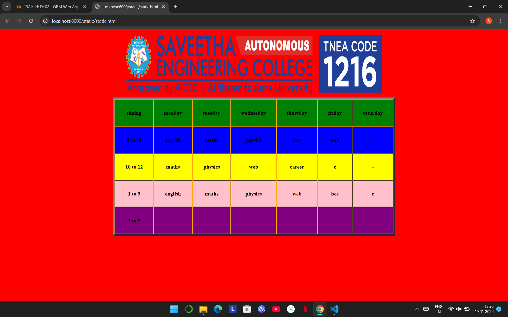

# Ex03 Time Table
## Date:

## AIM
To write a html webpage page to display your slot timetable.

## ALGORITHM
### STEP 1
Create a Django-admin Interface.

### STEP 2
Create a static folder and inert HTML code.

### STEP 3
Create a simple table using ```<table>``` tag in html.

### STEP 4
Add header row using ```<th>``` tag.

### STEP 5
Add your timetable using ```<td>``` tag.

### STEP 6
Execute the program using runserver command.

## PROGRAM
```
<html>
    <header><center></center></header>
    <body bgcolor="red"></body>
         <table length=100 cellpadding="30"  border="5" align="center" bgcolor="orange">
            <tr bgcolor="green">
                <th> timing </th>
                <th> monday </th>
                <th> tuesday</th>
                <th> wednesday</th>
                <th> thursday</th>
                <th> friday</th>
                <th> saturday </th>
            </tr>
             <tr bgcolor="blue">
            <th> 8 to 10 </th>
            <th> english</th>
            <th> maths</th>
            <th> physics</th>
            <th> bee</th>
            <th> web</th>
            <th> -</th>
            </tr>

            <tr bgcolor="yellow">
                <th> 10 to 12</th>
                <th> maths</th>
                <th> physics</th>
                <th> web</th>
                <th> career</th>
                <th> c</th>
                <th> -</th>
            </tr>
            <tr bgcolor="pink"> 
                <th> 1 to 3</th>
                <th> english</th>
                <th> maths</th>
                <th> physics</th>
                <th> web</th>
                <th> bee</th>
                <th> c</th>
            </tr>
            <tr bgcolor="purple">
                <th>3 to 5 </th>
                <th> -</th>
                <th>-</th>
                <th> -</th>
                <th> -</th>
                <th> -</th>
                <th> -</th>


            </tr>

        </table>
    </body>
</html>
```

## OUTPUT


## RESULT
The program for creating slot timetable using basic HTML tags is executed successfully.
